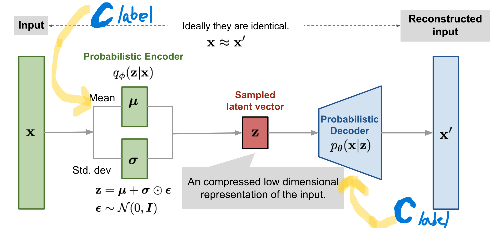
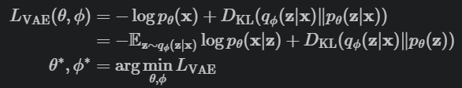

# CVAE
Model that Generates inputs for particular outputs in a sinosoidal function using CVAE

## Task

Our Task At Hand is to:
1. Predict the values of \( x_0 \) and \( x_1 \) that satisfy the equations \( y_1 = \sin(5x_0 + 3x_1) \) and \( y_2 = \cos(4x_0 + 8x_1) \), provided in the dataset located at ./data_1.

2. Take on the more demanding task of predicting the values of \( x_0 \) and \( x_1 \) that fulfill the equations \( y_1 = \cos(49x_0 + 63x_1) \) and \( y_2 = \cos(4x_0 + 8x_1) \), found in the dataset located at ./data_2.

## Algorithm:
An autoencoder is a type of neural network engineered to autonomously grasp the inherent identity of its input without explicit guidance, enabling it to reconstruct the initial data while concurrently condensing the information, thereby revealing a more streamlined and compressed depiction.
It consists of two networks:

Encoder network: It translates the original high-dimension input into the latent low-dimensional code. The input size is larger than the output size.
Decoder network: The decoder network recovers the data from the code, likely with larger and larger output layers.
The encoder network essentially accomplishes the dimensionality reduction, just like how we would use Principal Component Analysis (PCA) or Matrix Factorization (MF)
The model contains an encoder function g(.) parameterized by phi and a decoder function f(.) parameterized by theta. The low-dimensional code learned for input x in the bottleneck layer(sampled z) is z = g(x) and the reconstructed input is x’=f(g(x).

VAE is actually less similar to all the autoencoder models above, but deeply rooted in the methods of variational Bayesian and graphical models.

Instead of mapping the input into a fixed vector z, we want to map it into a distribution. The relationship between the data input x and the latent encoding vector x can be fully defined by:

1. Prior - P(z)
2. Likelihood - P (x/z)
3. Posterior - P (z/x)

Conditional Variational Autoencoders take a different turn and label the input and output data with a labelled given input.

## Architecture:
The following is the architecture behind CVAE:

Loss function is defined as:

The above loss function is for the Variational Autoencoders, while conditional VAE has a similar approach, except putting labels/conditions, i.e x changes to x/c, x/z changes to x/z,c and z/x changes to z/x,c , where C is the conditioned data or the labelled input data.

Following is the algorithm's structure:

1.  The Input space along with the conditional data has dim ( 1, 50,2 )
2.  Which Convolves into encoder network to ( 32,34,1 ) , kernal=16,2 , no. of params= ( 16 * 2 * 1+1)*32 
3.  Which again goes through the 2nd layer of convolution to ( 64, 26,1 ), kernal=8,1, params = (8* 1 * 32+1)*64 
4.  This Flattens to latent Space dimensions for getting mean and variance of distributions, params = ((1664* 2)+2)*2
5.  Furthur sampling from this distribution gives us z in our latent space
6.  After performing the reparameterization trick ( sampling epsilon from Gaussian and using linear transformation) and training z_hat
7. We move to the decoder part where the Neural Network remains the same but the the generation is based on the labels or conditions of known data.

As we discussed the CVAE Algorithm, we can see that the following Hyperparameters and Changes can play a big role of the model's outcomes.

## Hyperparamters and Changes

The Hyperparameters that affect the model are :

1.   Loss Function: There are various loss functions we can apply for the reconstruction of the input vector, for classification problems we mostly come across using Cross-Entropy loss function, but since out data is a generative problem, we will use MSE or L2, L1-Mean ( MAE ), L1-Sum as out choices for loss function.

    *   MSE ( Mean Squared Error ) -

          *   It is sensitive to outliers , hence less robust and assigns larger penalties to large deviations from the target value.
          *   Useful in regression problems and is suitable for continuous data where the exact match between the predicted and actual values is important.
          *   Does not perform well under large scale of input data

    *   L1-Mean ( Mean Absolute Error ) -

          *   Less sensitive , hence more robust to outliers
          *   Often used in situations where large errors are undesirable but occasional large errors are tolerable , as it tends to push some of the weights to zero, which can be beneficial in feature selection.

    *   L1-Sum -
    
          *   Functions as L1-Mean but doesnt take average of the losses
          *   Used  for comparison purposes

2.   Initialisation of Weights:
    *   Apart from using Zero Initalisation , we can use Methods like:

      * Xavier/Glorot Initialization: Also known as variance scaling initialization, this method scales the weights based on the number of input and output units, making it suitable for layers with **sigmoid and tanh** activation functions.
      * He Initialization: Similar to Xavier, but scales the weights based on the number of input units, making it suitable for layers with **ReLU activation functions.**
      * Orthogonal Initialization: Generates weights orthogonal to the preceeding layer's weights, which can help preserve the scale of activations and reduce the chance of vanishing or exploding gradients.
      * Random Initialization: Assigns small random numbers to weights. This is a simple method that doesn't rely on any assumptions about the activation function or the scale of activations

      The only right choice of initialization is He or Random Initialisation as our problem is less categorical and more regression based , therefore we will be using ReLu and He Initialisation in our model.

3.  Latent Dimensions: 

      *   Generalization: If the latent dimensions are too high , there is a possibility of acquiring even complex patterns in the datasets , this can be beneficial for a bigger dataset , however it comes with cost of overfitting .

      A smaller Latent space has an opposite affect and thus underfitting
      *   Sampling: While sampling from a large latent space ( with respect to dataset ) , the sampled z_hat can be distorted as it takes into account a large variety of features , hence can give deviating results. 

      While, on the other hand, if the latent space is small, the model has limited variability to sample from, which can make it challenging to generate diverse and distinguishing results.

      Therefore selecting the right latent space can be very important.
      In our case 10 is very low , 65-120 can be optimum latent space

4.  Beta ( Intensity of ( regularization) Minimisation Dkl loss ):

      *   Reconstruction Accuracy: A lower beta value increases the importance of the reconstruction loss relative to the KL divergence loss. This encourages the model to focus more on accurately reconstructing the input data, which is crucial for tasks where fidelity to the original data is essential.  But the model Penalises the distributions ( decoder Distribution) Q(Z/X) with Z~N(0,1)( coming from ( encoder distribution) after reparameterization technique) P(z) much less , therfore increasing the risk of creating transition data points ( the data points where the sampling is unknown or obscure)

      * Latent Space Regularization: A higher beta value places more emphasis on the KL divergence term, leading to a more regularized latent space. This regularization helps prevent overfitting and encourages the model to learn a more structured and meaningful representation of the data in the latent space
      * If Beta =0 , Penalises reconstruction loss heavily , therfore it has less correlation with prior disrtribution to describe data

5.  Wx and Wy ( intensity of Minimisation of reconstruction Loss ): 

      *   To minimise the Losses and bring the results closer to actual x/y , we can increase the dependency of wx and wy on average loss 
      *   wx: This Hyperparamter is for the reconstruction loss of the input data (x_loss).A higher value of wx increases the emphasis on accurately reconstructing the input data.

      * wy: This Hyperparameter is for the reconstruction loss of the conditional data (y_loss).A higher value of wy places more emphasis on accurately reconstructing the conditional data, while a lower value reduces its importance.
      * If Wx or Wy= 0 , it acts as an Variational AutoEncoder as one of the distribution is effectively representing a singular value because of small variance.

As we moved on to work our way to Hyperparamter tuning of out model we saw the following approaches:

1.   Manual Estimation using analysing plotted samples
2.   Grid Search
3.   Bayesian Optimization

In this Notebook , I will be exploring Manual Estimation , so as to get an idea of how CVAE works and changes in Loss function Hyperparameters can affect the model.

## Test Cases 

We took the following test cases and found out the optimum Hyperparamters for our different datasets found in the repo:
#### 2.4.1 Test Cases: Loss function = L1_mean

1.   $\beta$ = 1 , W1=0 , W2=0 ( above test case )
2.   $\beta$ = 0 , W1=1 , W2=0, latent_dim=100
3.  $\beta$ = 0 , W1=1 , W2=1, latent_dim=100
4.  $\beta$ = 1 , W1=0.5 , W2=0.5, latent_dim=100
5.  $\beta$ = 0.8 , W1=0.6 , W2=0.6, latent_dim=60
6.  $\beta$ = 0.8 , W1=0.65 , W2=0.72 , latent_dim=85

#### 2.4.2 Test Cases: Loss function = MSE

1.  $\beta$ = 1 , W1=0.5 , W2=0.5
2.  $\beta$ = 0.8 , W1=0.6 , W2=0.6

#### 2.4.3 Test Cases: Loss function = L1_sum

1.  $\beta$ = 1 , W1=0.5 , W2=0.5

From Above test cases we can derive :

## Results
1. Latent space> 100
2. beta>1
3. 0.7 >wx > 0.5
4. 0.65>wy>0.5
5. Min epochs = 25

For Future Prospects one can do Optimization using Bayesian Optimisation and GridSearch but due to lack of computational power , this has been postponed.
